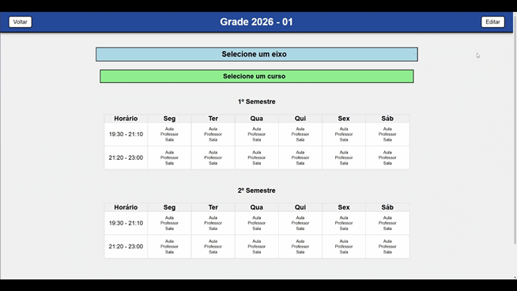

# Easy Grade

Sistema web fullstack para criação e gerenciamento de grades horárias acadêmicas, desenvolvido com React, Node.js, Express e PostgreSQL.

O projeto permite estruturar grades por eixos, cursos e semestres, além de gerenciar aulas com validação visual de conflitos entre professores e salas.

---

# Preview

## Visualização da grade

<!-- Substitua pelos seus GIFs -->


## Edição da grade


---

# Funcionalidades

- Criação de grades acadêmicas
- Organização hierárquica:
  - Eixos
  - Cursos
  - Semestres
  - Aulas
- Editor lateral para aulas
- Seleção de:
  - Professor
  - Matéria
  - Sala
- Detecção visual de conflitos:
  - Professor em dois lugares ao mesmo tempo
  - Sala ocupada simultaneamente
- Persistência completa em PostgreSQL
- Atualização dinâmica da interface
- Estrutura modularizada com hooks customizados
- CRUD completo via API REST

---

# Tecnologias Utilizadas

## Frontend

- React
- React Router DOM
- CSS3
- Hooks customizados

## Backend

- Node.js
- Express
- PostgreSQL
- pg
- CORS

---

# Estrutura da Grade

```txt
Grade
 └── Eixos
      └── Cursos
           └── Semestres
                └── Aulas
```

---

# Instalação

## 1. Clone o repositório

```bash
git clone https://github.com/TexDiego/Easy-Grade.git
```

---

## 2. Instale as dependências

### Frontend

```bash
cd frontend
npm install
```

### Backend

```bash
cd backend
npm install
```

---

# Configuração do Banco de Dados

Crie um banco PostgreSQL e execute o script SQL de criação das tabelas.

Configure a conexão no arquivo:

```txt
backend/Data/db.js
```

Exemplo:

```js
const pool = new Pool({
  user: "postgres",
  host: "localhost",
  database: "easy_grade",
  password: "sua_senha",
  port: 5432,
});
```

---

# Executando o Projeto

## Backend

```bash
npm run dev
```

Servidor:

```txt
http://localhost:3000
```

---

## Frontend

```bash
npm run dev
```

Aplicação:

```txt
http://localhost:5173
```

---

# API REST

## Principais rotas

### Grades

```http
GET /grades
GET /grades/:id/full
POST /grades
```

### Eixos

```http
POST /grade-eixos
PUT /grade-eixos/:id
DELETE /grade-eixos/:id
```

### Cursos

```http
POST /grade-cursos
PUT /grade-cursos/:id
DELETE /grade-cursos/:id
```

### Semestres

```http
POST /semestres
DELETE /semestres/:id
```

### Aulas

```http
POST /schedule
DELETE /schedule
```

---

# Melhorias Futuras

- Autenticação de usuários
- Exportação PDF/Excel
- Validação de conflitos no backend
- Responsividade mobile
- Tema escuro
- Otimização de performance

---

# Objetivo do Projeto

Este projeto foi desenvolvido com foco em aprendizado fullstack e modelagem de sistemas acadêmicos reais, explorando:

- Estruturas relacionais complexas
- Persistência de dados
- Organização arquitetural
- Sincronização frontend/backend
- Manipulação profunda de estado no React

---

# Autor

Desenvolvido por Diego.

GitHub:
https://github.com/TexDiego
