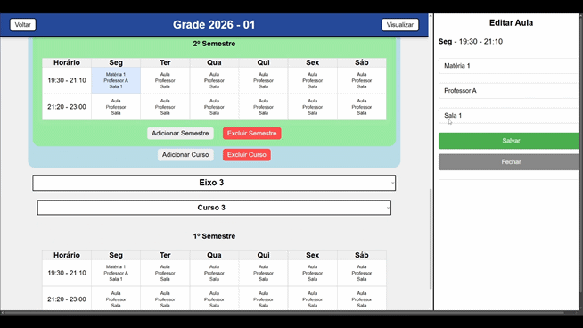

# Easy Grade

Sistema web fullstack para criação e gerenciamento de grades horárias acadêmicas.

O projeto permite estruturar grades por eixos, cursos e semestres, além de gerenciar aulas com detecção automática de conflitos entre professores e salas.

---

# Preview

## Visualização da Grade


## Edição da Grade



---

# Arquitetura

O projeto foi refatorado para uma arquitetura fullstack modularizada, separando frontend e backend em um monorepo.

```txt
Easy Grade
│
├── backend
│   ├── EasyGrade.API
│   ├── EasyGrade.Application
│   ├── EasyGrade.Domain
│   └── EasyGrade.Infrastructure
│
├── frontend
│   ├── src
│   ├── public
│   └── vite.config.js
│
└── README.md
```

---

# Funcionalidades

- Criação de grades acadêmicas
- Organização hierárquica:
  - Eixos
  - Cursos
  - Semestres
  - Aulas
- Editor lateral para gerenciamento de aulas
- Seleção dinâmica de:
  - Professores
  - Matérias
  - Salas
- Detecção visual de conflitos:
  - Professor em múltiplas aulas simultâneas
  - Sala ocupada simultaneamente
- Persistência completa em PostgreSQL
- API REST modularizada
- Estrutura orientada a domínio
- Hooks customizados no frontend
- Atualização dinâmica da interface

---

# Tecnologias Utilizadas

## Frontend

- React
- Vite
- React Router DOM
- CSS3
- Hooks customizados

## Backend

- ASP.NET Core
- Entity Framework Core
- PostgreSQL
- Npgsql
- REST API

## Banco de Dados

- PostgreSQL

---

# Estrutura Acadêmica

```txt
Grade
 └── Eixos
      └── Cursos
           └── Semestres
                └── Aulas
```

---

# Arquitetura Backend

O backend segue uma arquitetura em camadas baseada em Domain-Driven Design (DDD):

```txt
EasyGrade.API
    Responsável pela API REST

EasyGrade.Application
    Regras de aplicação

EasyGrade.Domain
    Entidades e regras de domínio

EasyGrade.Infrastructure
    Persistência e acesso a dados
```

---

# Instalação

## 1. Clone o repositório

```bash
git clone https://github.com/TexDiego/Easy-Grade.git
```

---

# Configuração do Backend

## Acesse a pasta backend

```bash
cd backend
```

---

## Configure o banco de dados

Crie um banco PostgreSQL e configure a connection string no arquivo:

```txt
backend/EasyGrade.API/appsettings.json
```

Exemplo:

```json
{
  "ConnectionStrings": {
    "DefaultConnection": "Host=localhost;Database=easy_grade;Username=postgres;Password=sua_senha"
  }
}
```

---

## Execute as migrations

```bash
dotnet ef database update
```

---

## Execute a API

```bash
dotnet run --project EasyGrade.API
```

API disponível em:

```txt
http://localhost:5165
```

---

# Configuração do Frontend

## Acesse a pasta frontend

```bash
cd frontend
```

---

## Instale as dependências

```bash
npm install
```

---

## Execute o frontend

```bash
npm run dev
```

Aplicação disponível em:

```txt
http://localhost:5173
```

---

# API REST

## Grades

```http
GET    /grades
GET    /grades/{id}/full
POST   /grades
PUT    /grades/{id}
DELETE /grades/{id}
```

## Eixos

```http
POST   /grade-eixos
PUT    /grade-eixos/{id}
DELETE /grade-eixos/{id}
```

## Cursos

```http
POST   /grade-cursos
PUT    /grade-cursos/{id}
DELETE /grade-cursos/{id}
```

## Semestres

```http
POST   /semestres
PUT    /semestres/{id}
DELETE /semestres/{id}
```

## Aulas

```http
POST   /aulas
PUT    /aulas/{id}
DELETE /aulas/{id}
```

---

# Roadmap

- Autenticação JWT
- Controle de usuários
- Exportação PDF/Excel
- Responsividade mobile
- Tema escuro
- Deploy cloud
- Dockerização
- Testes automatizados
- Swagger/OpenAPI
- Cache e otimização de performance

---

# Objetivos do Projeto

Este projeto foi desenvolvido com foco em:

- Arquitetura fullstack moderna
- Modelagem acadêmica relacional
- Domain-Driven Design
- APIs REST
- Persistência relacional
- Organização escalável de software
- Manipulação complexa de estado no React

---

# Autor

Desenvolvido por Diego.

GitHub:
https://github.com/TexDiego
